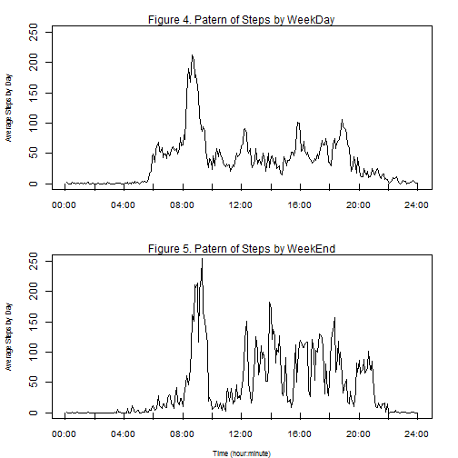

## Loading and preprocessing the data
The row data was in a zip located in the file called "./RepData_PeerAssessment1/data" in the working directory and it was read by the following code:


```r
unzip ("./data/activity.zip", exdir="./data")
datas<-read.csv("./data/activity.csv", sep=",", header=TRUE)
```

The variables included in this dataset are:  
steps: Number of steps taking in a 5-minute interval (missing values are coded as NA)  
date: The date on which the measurement was taken in YYYY-MM-DD format  
interval: Identifier for the 5-minute interval in which measurement was taken  
The dataset is stored in a comma-separated-value (CSV) file and there are a total of 17,568 observations in this dataset, as it is shown:  

#### Summary of Original Data

```r
summary(datas)
```

```
##      steps                date          interval     
##  Min.   :  0.00   2012-10-01:  288   Min.   :   0.0  
##  1st Qu.:  0.00   2012-10-02:  288   1st Qu.: 588.8  
##  Median :  0.00   2012-10-03:  288   Median :1177.5  
##  Mean   : 37.38   2012-10-04:  288   Mean   :1177.5  
##  3rd Qu.: 12.00   2012-10-05:  288   3rd Qu.:1766.2  
##  Max.   :806.00   2012-10-06:  288   Max.   :2355.0  
##  NA's   :2304     (Other)   :15840
```
In order to know how important are the missing values in the data set, we calculate the porcentage of NA큦. 

```r
    wherena<-which(is.na(datas$steps))
    manyna=length(which(is.na(datas$steps)))
    manyda=length(datas$steps)
    porcent=round((manyna/manyda)*100,2)
```

The original dataset has 17568 observations and there are 2304 NA which is 13.11 % of the original data set.  

A new data set without missing values was created and it was called "datasnona", which is shown in the following summary.


```r
    datasnona<-subset(datas, datas$steps != "NA")
    summary(datasnona)
```

```
##      steps                date          interval     
##  Min.   :  0.00   2012-10-02:  288   Min.   :   0.0  
##  1st Qu.:  0.00   2012-10-03:  288   1st Qu.: 588.8  
##  Median :  0.00   2012-10-04:  288   Median :1177.5  
##  Mean   : 37.38   2012-10-05:  288   Mean   :1177.5  
##  3rd Qu.: 12.00   2012-10-06:  288   3rd Qu.:1766.2  
##  Max.   :806.00   2012-10-07:  288   Max.   :2355.0  
##                   (Other)   :13536
```

Then, it was calculated the total number of steps taken per day . Also, it was calculated the mean and the median of the total number of steps taken per day without taken account for the missing value and shown in the following summary.

#### Summary of Total Steps By Day w/o NA


```r
    databyday<-aggregate(datas$steps, list(date=datas$date), sum)
    summary(databyday)
```

```
##          date          x        
##  2012-10-01: 1   Min.   :   41  
##  2012-10-02: 1   1st Qu.: 8841  
##  2012-10-03: 1   Median :10765  
##  2012-10-04: 1   Mean   :10766  
##  2012-10-05: 1   3rd Qu.:13294  
##  2012-10-06: 1   Max.   :21194  
##  (Other)   :55   NA's   :8
```

```r
    mean<- mean(databyday$x, na.rm=TRUE)
    median<- median(databyday$x,na.rm=TRUE)
    nadatabyday<-length(which(is.na(databyday$x)))
```

In order to know the influence of missing values in results, it was used an strategy of create a new dataset called "datanew" where it was filling out the missing value with the mean of the total steps taken by interval, removing missing values. 

#### Summary of New Data Set with NA replaced

```r
    datanew<-datas
    datanew$steps[is.na(datanew$steps)]<- tapply(datanew$steps,
                          datanew$interval,mean, na.rm=TRUE)
    summary(datanew)
```

```
##      steps                date          interval     
##  Min.   :  0.00   2012-10-01:  288   Min.   :   0.0  
##  1st Qu.:  0.00   2012-10-02:  288   1st Qu.: 588.8  
##  Median :  0.00   2012-10-03:  288   Median :1177.5  
##  Mean   : 37.38   2012-10-04:  288   Mean   :1177.5  
##  3rd Qu.: 27.00   2012-10-05:  288   3rd Qu.:1766.2  
##  Max.   :806.00   2012-10-06:  288   Max.   :2355.0  
##                   (Other)   :15840
```

With these new data set it was calculated again the mean and the median of the total steps taken by day. The summary of results for the new dataset is calculated as follow.

#### Summary of Total Step by Day w NA replaced

```r
    databydaynew<-aggregate(datanew$steps,list(date=datanew$date),sum)
    wherenanew<-which(is.na(datanew$steps))
    manynanew<-length(which(is.na(datanew$steps)))
    manydanew<-length(datanew$steps)
    meannew<- mean(databydaynew$x)
    mediannew<- median(databydaynew$x)
    summary(databydaynew)
```

```
##          date          x        
##  2012-10-01: 1   Min.   :   41  
##  2012-10-02: 1   1st Qu.: 9819  
##  2012-10-03: 1   Median :10766  
##  2012-10-04: 1   Mean   :10766  
##  2012-10-05: 1   3rd Qu.:12811  
##  2012-10-06: 1   Max.   :21194  
##  (Other)   :55
```

The new data set was included with a new column called "whichday" to register if the date is refering to a "weekend" day or a "weekday".
This dataset is called "datasnew".  

#### Summary of New Data Set with new column whichday (weekend/weekday)

```r
library(dplyr)
    datasnew<- datanew
    datasnew$date<-as.Date(datasnew$date)
    datasnew<-mutate(datasnew, 
    whichday=factor(1*(weekdays(date)=="Saturday"| 
    weekdays(date)=="Sunday   "),labels=c("weekday","weekend")))
    summary(datasnew)
```

```
##      steps             date               interval         whichday    
##  Min.   :  0.00   Min.   :2012-10-01   Min.   :   0.0   weekday:15264  
##  1st Qu.:  0.00   1st Qu.:2012-10-16   1st Qu.: 588.8   weekend: 2304  
##  Median :  0.00   Median :2012-10-31   Median :1177.5                  
##  Mean   : 37.38   Mean   :2012-10-31   Mean   :1177.5                  
##  3rd Qu.: 27.00   3rd Qu.:2012-11-15   3rd Qu.:1766.2                  
##  Max.   :806.00   Max.   :2012-11-30   Max.   :2355.0
```


## What is mean total number of steps taken per day?

The mean total steps taken per day without taken account missing values is 1.0766189 &times; 10<sup>4</sup>. Replacing NA by the mean of total steps by day, by interval and calculating again the mean does not change. However the median changes slightly from 10765to 1.0766189 &times; 10<sup>4</sup>. The values are summarized in Table 1.  

#### Total Steps by Day(Mean,Median comparing NA replaced and without NA)

```r
   library(xtable)    
    table1 <- matrix(c(mean,median,meannew,mediannew),ncol=2,byrow=TRUE)
    colnames(table1) <- c("Mean","Median")
    rownames(table1) <- c("Original Dataset","Dataset with NA replaced")
    xtable1<-xtable(head(table1),caption="Table 1. Total Steps By Day")
    print(xtable1, comment=FALSE, type="html", caption.placement="top")
```

<table border=1>
<caption align="top"> Table 1. Total Steps By Day </caption>
<tr> <th>  </th> <th> Mean </th> <th> Median </th>  </tr>
  <tr> <td align="right"> Original Dataset </td> <td align="right"> 10766.19 </td> <td align="right"> 10765.00 </td> </tr>
  <tr> <td align="right"> Dataset with NA replaced </td> <td align="right"> 10766.19 </td> <td align="right"> 10766.19 </td> </tr>
   </table>

#### Total Steps by Day (Histogram comparing NA replaced and without NA)
The following figure shows the histogram of the mean of total steps taken by day in both dataset, original and new with missing values replaced.


```r
    par(mfrow=c(2,1), mar=c(3,4,2,2), oma=c(0,0,0,0))
    xname<-"Figure 1. Total Steps by Day - w/o-NA"
    colors = c("red") 
    histwoNA<-hist(databyday$x, breaks=20,
    freq = TRUE, include.lowest = TRUE, right = TRUE,
    main = paste(xname, "- Histogram"),
    xlab = xname, ylab="Frequency", ylim=c(0,20),
    axes = TRUE, plot = TRUE, 
    col=colors,
    warn.unused = TRUE)
    xname<-"Figure 2. Total Steps by Day - w-NA replaced"
    colors = c("green") 
    histwNArep<-hist(databydaynew$x, breaks=20,
    freq = TRUE, include.lowest = TRUE, right = TRUE,
    main = paste(xname, "- Histogram"),
    xlab = xname, ylab="Frequency",ylim=c(0,20),
    axes = TRUE, plot = TRUE, 
    col=colors,
    warn.unused = TRUE)
    mtext("Steps By Day", side=1, line=2, cex=0.7,las=0)
```

 

```r
##    dev.copy(png, file= "./figures/plotfigure1-2.png")
##    dev.off()
```


## What is the average daily activity pattern?

The average daily activity pattern is shown in Figure 2 and it was calculated with the mean by 5-min.interval, in all dates exiting in original data set without missing values ("datasnona"). 

#### Times Series averaging for 5 min-interval


```r
      dataaveint<-aggregate(datasnona$steps,
      list(interval=datasnona$interval),mean)
      par(mfrow=c(1,1), mar=c(3,4,2,2), oma=c(0,0,0,0))
      y<-dataaveint$x
      plot(y, type="n", xaxt="n", ann=FALSE)
      lines(y, type="l" )
## Adding labels
      xx=c("00:00","02:00","04:00","06:00","08:00","10:00","12:00",
          "14:00","16:00","18:00","20:00","22:00","24:00")
      axis(1, at=seq(0, 288, by=24),labels=xx,lwd=0,lwd.ticks=1,
      las=0, pos=0,cex.axis=0.8, 
      mtext("Figure 3. Patern of Steps by Day"))
      mtext("Average Steps by Day", side=2, line=3, cex=0.7,las=0)
      mtext("Time (hour:minute)", side=1, line=2, cex=0.7,las=0)
```

 

```r
##    dev.copy(png, file= "./figures/plotfigure3.png")
##    dev.off()
      max<-subset(dataaveint, dataaveint$x == max(dataaveint$x))
      max
```

```
##     interval        x
## 104      835 206.1698
```
As you can see, the 5-minute.interval with the maximum average number of steps, across all days in the data set occurs in interval 835 with a value of 206.1698113.


## Imputing missing values

The total number of missing values is 2304, which represents 13.11of the original data registers.
When missing values are imputed with a strategy of filling them with the average number of steps per day per interval, the results are almost
not affected, since the mean changes from 1.0766189 &times; 10<sup>4</sup> to 1.0766189 &times; 10<sup>4</sup> and the median changes from 10765to 1.0766189 &times; 10<sup>4</sup> . (Table 1). That means the median take the same value that the mean

In Figure 1 you can see the histograms of the two cases, without NA큦 and with NA큦 replaced with the strategy mentioned before. Additionally, it is illustrative to know the breaking and counting elements of the histograms of average total steps by day, without NA큦 and with NA큦 replaced, which is shown in the following summary.


```r
      histwoNA$breaks
```

```
##  [1]     0  1000  2000  3000  4000  5000  6000  7000  8000  9000 10000
## [12] 11000 12000 13000 14000 15000 16000 17000 18000 19000 20000 21000
## [23] 22000
```

```r
      histwoNA$counts
```

```
##  [1]  2  0  1  1  1  2  1  2  5  2 10  6  6  4  2  5  0  1  0  0  1  1
```

```r
      histwNArep$breaks
```

```
##  [1]     0  1000  2000  3000  4000  5000  6000  7000  8000  9000 10000
## [12] 11000 12000 13000 14000 15000 16000 17000 18000 19000 20000 21000
## [23] 22000
```

```r
      histwNArep$counts
```

```
##  [1]  2  0  1  1  1  2  1  2  5  2 18  6  6  4  2  5  0  1  0  0  1  1
```


The results in Figure 1 and the histograms counting shown above, evidence that diferences are only in the frecuence of steps for the 5-min interval that contain the mean, which increases due to the 8 missing values that now are accounting with the same value that the mean.


## Are there differences in activity patterns between weekdays and weekends?

With the data set called "datasnew", which was gotten adding a new column called "whichday" to the data set already modified with NA replaced ("datanew""), we can compare the patterns between weekdays and weekend. In order to do so, the data set was split in two parts. 


```r
      dataaveint1<-aggregate(datasnew$steps,
                  list(interval=datasnew$interval,
                  whichday=datasnew$whichday), mean)
      dataaveint1$sec<-c(1:576)
      dataaveint1$sec<-as.numeric(dataaveint1$sec)
      summary(dataaveint1)
```

```
##     interval         whichday         x                sec       
##  Min.   :   0.0   weekday:288   Min.   :  0.000   Min.   :  1.0  
##  1st Qu.: 588.8   weekend:288   1st Qu.:  1.436   1st Qu.:144.8  
##  Median :1177.5                 Median : 25.565   Median :288.5  
##  Mean   :1177.5                 Mean   : 39.665   Mean   :288.5  
##  3rd Qu.:1766.2                 3rd Qu.: 58.230   3rd Qu.:432.2  
##  Max.   :2355.0                 Max.   :255.139   Max.   :576.0
```

```r
      dataaveint2<-subset(dataaveint1, dataaveint1$whichday== "weekday")
      dataaveint3<-subset(dataaveint1, dataaveint1$whichday== "weekend")
```

The plotting was draw with the same scale, in the same window with two rows.

```r
##Making the plot
      par(mfrow=c(2,1), mar=c(3,4,2,2))
      y<-dataaveint2$x
      plot(y, type="n", xaxt="n", ann=FALSE, ylim=c(0, 250))
## Adding lines
      lines(y, type="l" )
## Adding labels
      xx=c("00:00","02:00","04:00","06:00","08:00","10:00","12:00",
      "14:00","16:00","18:00","20:00","22:00","24:00")
      axis(1, at=seq(0, 288, by=24),labels=xx,lwd=0,lwd.ticks=1,
      las=0, pos=0,cex.axis=0.8, 
      mtext("Figure 4. Patern of Steps by WeekDay"))
      mtext("Average Steps by Day", side=2, line=3, cex=0.7,las=0)
      yy<-dataaveint3$x
      plot(yy, type="n", xaxt="n", ann=FALSE, ylim=c(0,250))
## Adding lines
      lines(yy, type="l" )
## Adding labels
      xx=c("00:00","02:00","04:00","06:00","08:00","10:00","12:00",
      "14:00","16:00","18:00","20:00","22:00","24:00")
      axis(1, at=seq(0, 288, by=24),labels=xx,lwd=0,lwd.ticks=1,
      las=0, pos=0,cex.axis=0.8, 
      mtext("Figure 5. Patern of Steps by WeekEnd"))
      mtext("Average Steps by Day", side=2, line=3, cex=0.7,las=0)
      mtext("Time (hour:minute)", side=1, line=2, cex=0.7,las=0)
```

 

```r
##    dev.copy(png, file= "./figures/plotfigure4-5.png")
##    dev.off()
```

As you can see in Figure 4 and Figure 5, there are differents activity patterns for weekdays and weekend. The peak of steps by interval is different from weekdays than weekend.


```r
      max2<-subset(dataaveint2, dataaveint2$x == max(dataaveint2$x))
      max2
```

```
##     interval whichday        x sec
## 104      835  weekday 212.8526 104
```

```r
      max3<-subset(dataaveint3, dataaveint3$x == max(dataaveint3$x))
      max3
```

```
##     interval whichday        x sec
## 400      915  weekend 255.1392 400
```

During the weekdays the peak occurs at 5-min.interval 835 with 212.8526166 steps and during weekend the peak occurs at 5-min.interval 915 with 255.1391509steps. 
